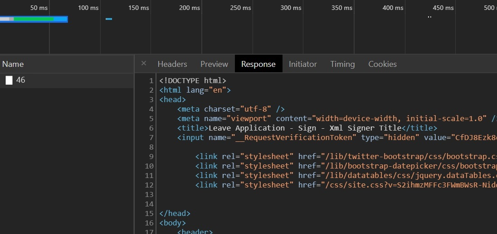
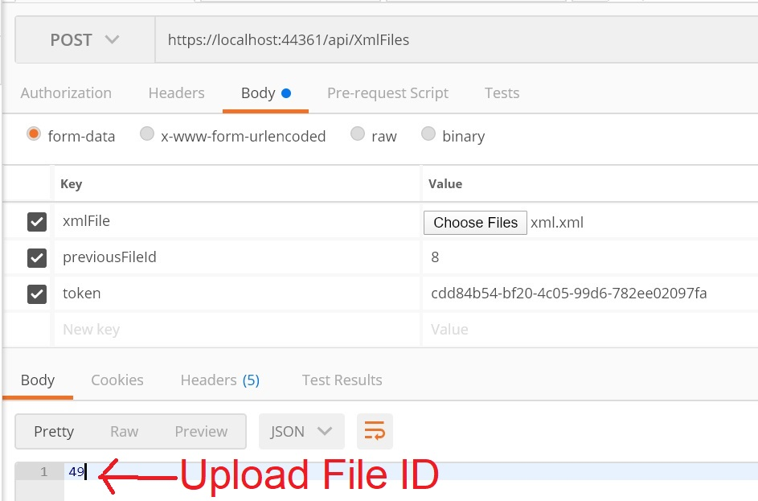
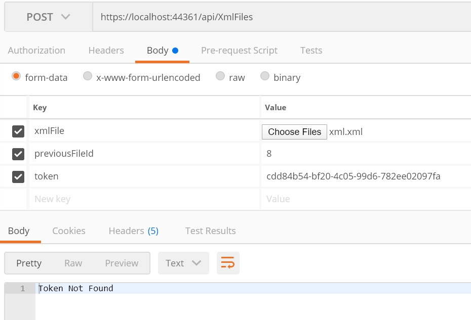
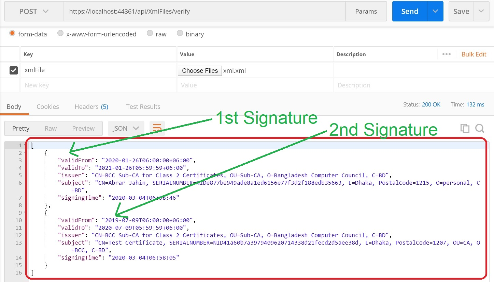
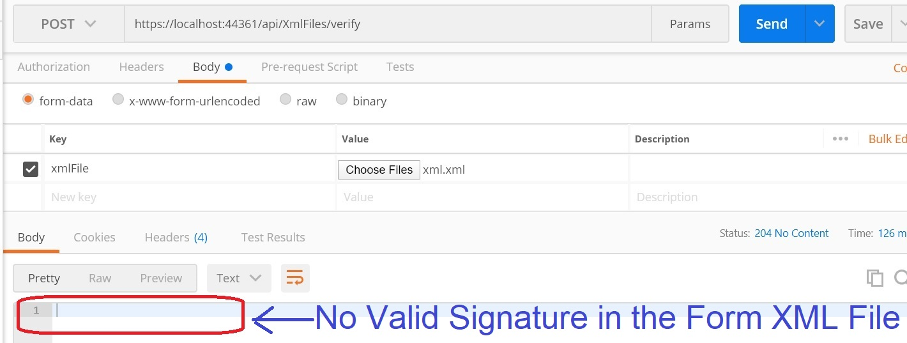

# BCC-CA XML Signer Srever

This app is an example server of [BCC-CA Desktop Client](https://github.com/AbrarJahin/BCC-CA_XMLSigningClient) built on [ASP.Net Core 3.1](https://dotnet.microsoft.com/download/dotnet-core/3.1) with [PostGRE Database](https://www.postgresql.org/). We are using ASP.Net Core and PostGRE because both of them are open source and can be hosted in cheap ***Linux Server*** ([*Ubuntu*](https://docs.microsoft.com/en-us/aspnet/core/host-and-deploy/linux-nginx?view=aspnetcore-3.1), [*CentOS*](https://www.vultr.com/docs/how-to-deploy-a-net-core-web-application-on-centos-7) etc.) with full functionality. If anyone like to use another DB, then here is the whole [list of supported databases](https://docs.microsoft.com/en-us/ef/core/providers/?tabs=dotnet-core-cli#current-providers). For MySQL, along with [official connector library](https://dev.mysql.com/doc/connector-net/en/connector-net-entityframework-core.html), other convenient libraries can be used like [Pomelo.EntityFrameworkCore.MySql](https://github.com/PomeloFoundation/Pomelo.EntityFrameworkCore.MySql) for MySQL as well as [MariaDB](https://mariadb.org/). If connection string for databases need to be updated, then they can be updated from [***this file***](./appsettings.json#L3). If other databases rather than PostGRE need to be used, then the DB should be configured from [here](./Startup.cs#L24).
This web app will be used as one of the server examples for the signer  app. This app will also be used as XML Signature verification service. Most common commands and links regarding ASP.Net Core is provided in [here](.doc/Links_and_Commands.md).

In this web app,  provide [this](https://github.com/AbrarJahin/BCC-CA_XMLSigningClient#installation-and-deployment) mentioned APIs as well as XML verification service along with XML [serialization](/Library/Adapter.cs#L39) and [deserialization](/Library/Adapter.cs#L52).

## APIs needed for enabling signature for web forms
In this web app, there are mainly 4 APIs implemented for enabling signature-

1. [Generate Download-Upload Token](#generate-download-upload-token)
2. [Download XML File](#download-xml-file-get-api)
3. [Upload XML File](#upload-xml-file-post-api)
4. [Verify XML File Signature](#verify-xml-file-signature)

Among these APIs, [Download XML File API](#download-xml-file-get-api) and [Upload XML File API](#upload-xml-file-post-api) is directly used by the [BCC-CA Desktop Signing Client](https://github.com/AbrarJahin/BCC-CA_XMLSigningClient#api-list-needed-in-the-server).
Along with those APIs, conversion of any form data model to XML and XML to that form data is also provided in [here](./Library/Adapter.cs#L39) and [here](./Library/Adapter.cs#L52). Retrieving the signing time from the [`Signature->SignedInfo->Reference->Id`]() is provided in [here](./Library/Adapter.cs#L22). The signing-time is stored in [base64](https://en.wikipedia.org/wiki/Base64) format because `Id` field does not support any [whitespace](https://en.wikipedia.org/wiki/Whitespace_character) and Id is one of the best places where custom unalterable string can be stored.

### Generate Download-Upload Token
This API is implemented in [here](./Controllers/api/XmlFilesController.cs#L38). With this API, an authenticated user generates a secured token for downloading and uploading a file. The API is [called by the browser](./wwwroot/js/site.js#L16) before initiating download of a file. After the API is called, a token is provided for 2 minutes for downloading and uploading the file. As the client can't access the authentication of the user in the browser directly, this token generation and maintaining are strictly suggested to maintain authorization. For this example, the API call can be like this-

- **Successful Call**

- **Unsuccessful Call**
If the user is unauthorised, the AJAX call will not return any token like this-

and

### Download XML File Get API
In this architecture of enabling digital signing to any web form, we are storing the web form as XML which is easily signed digitally. The XML is stored in the server as text entry in a database as text in a column, so before initiate the downloading the file, the XML string should be converted to Byte Array and Byte Array should be converted to Memory Stream for creating a file which will be downloaded. So, the XML file is stored in nowhere in the server but stored as an XML text, when needed, the text is converted as XML file. With this API, any XML file can be downloaded, but the XML file download URL can live for a small-time with strong token validation so that the file security can be assured and no unauthenticated person or service can download the file and retrieve the data. To do that, we have created an API for generating a download-upload token in [here](#generate-download-upload-token). It is an API where only XML file can be downloaded with ***GET*** request like this-

The implementation code can be found in [here](./Controllers/api/XmlFilesController.cs#L62).

### Upload XML File POST API
This API is implemented in [here](./Controllers/api/XmlFilesController.cs#L90).
With this API, any file can be uploaded in server with an authentically generated token. After uploaded to the server, the file is converted to a string and stored in the database with required properties.

[Postman](https://www.postman.com/) example call can be like this-

- **Success**

- **Fail**

If File upload failed, then a response will be sent like this-

### Verify XML File Signature
This API is implemented in [here](./Controllers/api/XmlFilesController.cs#L242). With this API, any signature can be verified if the signed XML file is perfectly signed or not. A demo call with [Postman](https://www.postman.com/) client is like this-

- **Successfully verified**

- **Unverified**

